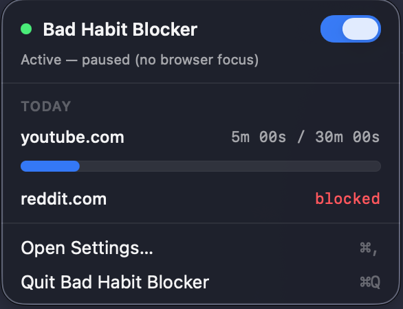
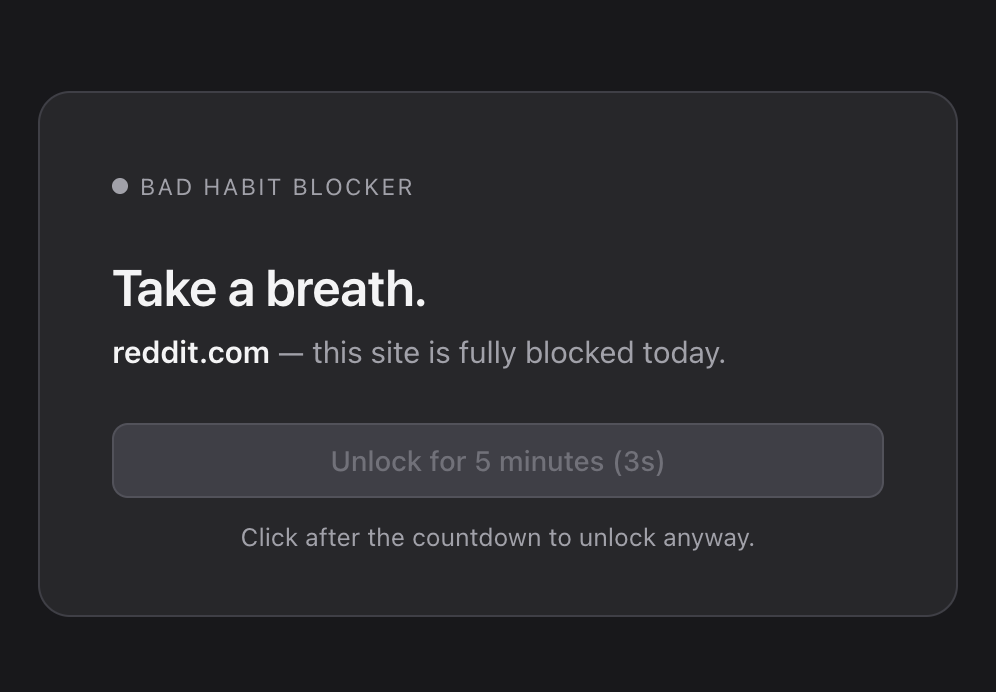

# Bad Habit Blocker

A macOS menubar app that throttles or blocks distracting websites by routing browser traffic through a local HTTPS proxy. Personal-use, no cloud, no sync.

You list sites you want to limit. The app gives you a daily quota for each (say, 30 minutes of YouTube) or blocks them outright. When the quota runs out, the site shows a custom block page instead. There's a "for 5 more minutes" escape button if you really need it.



---

## Requirements

- macOS 13 (Ventura) or later
- For building from source: Xcode Command Line Tools and Go 1.23+

## Install

No distribution yet. Build it from source:

```sh
git clone <repo>
cd bad-habit-blocker
make app
open build/BadHabitBlocker.app
```

The first launch opens an onboarding window that walks you through installing the local root certificate (one admin prompt). After that the shield icon lives in the menubar.

---

## Using it

### The menubar icon

The shield in the menubar tells you the state at a glance:

- Outline shield: off
- Green filled shield: on, no quota hit yet
- Yellow filled shield: on, at least one site is at its daily quota
- Red: the proxy crashed or system proxy failed

Click the shield to open the popover.

### Turning protection on and off

Flip the switch in the popover. When on, the app starts the local proxy and points your system proxy at it (all network services: Wi-Fi, Ethernet, etc.). When off, the proxy stops and the system proxy is restored. Internal traffic (localhost, RFC1918, `.local`) is always bypassed.

### Adding sites

Open Settings (⌘,) and go to the Sites tab. Each rule has:

- A domain (`youtube.com`, `reddit.com`, etc.)
- A mode: **Off** / **Timed** / **Blocked**
- For Timed: a daily limit in minutes

Subdomains and known CDN hosts roll up automatically. Adding `youtube.com` covers `m.youtube.com`, `googlevideo.com`, `ytimg.com`, `youtu.be`. Same for `x.com` / `twitter.com` and `reddit.com` / `redd.it`.

Save to apply. If the app is running, the change takes effect on the next request, no restart needed.

### How time is counted

Time counts only when both are true:

1. A browser is the frontmost macOS app
2. You've moved the mouse, typed, or scrolled in the last 30 seconds

A YouTube tab open in the background while you write code doesn't burn quota. Neither does walking away from the laptop with the browser still focused. The popover status line tells you which mode the tracker is in ("Active — tracking" or "Active — paused (no browser focus)").

The day resets at local midnight. Usage persists to `usage.json` so a restart mid-day keeps your numbers.

### The block page

When a site is blocked, the proxy serves a calm HTML page in its place. It tells you why (daily limit reached, or always blocked), how long until midnight, and how much time you used.



There's a single button: **Unlock for 5 minutes**. It starts disabled with a 10-second countdown. Click after the countdown to grant yourself a temporary bypass. If you've set a password (see below), you also have to type it.

While a bypass is active, the popover shows a yellow "UNLOCKED" row with a live countdown so you don't forget the clock is ticking.

### Password protection

In Settings → Security, you can require a password for:

- Disabling the app from the menubar
- Editing rules in Settings
- Using the "unlock 5 minutes" button on the block page
- Quitting the app

It's stored as an Argon2id hash, never plaintext. If you forget it, the only way out is **Reset everything** from the About tab, which wipes the password along with everything else.

### Launch at login

Settings → General has a switch. First time you enable it, macOS may need approval from you in System Settings → General → Login Items (the app gives you a link).

### Reset everything

About tab → **Reset everything…**. Wipes config, usage, password, removes the trusted certificate from your keychain (admin prompt), disables autostart, clears system proxy. The app stays on disk so you can throw it in the Trash yourself.

---

## Troubleshooting

**Browsers can't load any sites after the app crashed.**
The next launch detects orphaned proxy settings and clears them automatically. If you can't even launch the app, run this in Terminal to clear the system proxy by hand:

```sh
for s in $(networksetup -listallnetworkservices | tail -n +2 | sed 's/^\*//'); do
  networksetup -setwebproxystate "$s" off
  networksetup -setsecurewebproxystate "$s" off
done
```

**A site (bank, Apple service) won't load through the proxy.**
Cert-pinned sites break under HTTPS interception. The app already passes through Apple, iCloud, Microsoft Authenticator, and a handful of major banks. To add more, edit the list in `proxy/passthrough.go` and rebuild. A UI for this is on the wishlist.

**Block page never shows up.**
Make sure the proxy is actually intercepting: System Settings → Network → Wi-Fi → Details → Proxies should show "Web Proxy 127.0.0.1:8888" enabled while the app is on. If not, toggle the app off and on again.

**Reading the logs.**
About tab → "Open logs folder". Or:

```
~/Library/Application Support/BadHabitBlocker/logs/proxy.log
```

---

## For developers

### Architecture

Two processes talking over a Unix socket:

```
┌──────────────────────────────┐
│  Swift menubar app           │
│  - MenuBarExtra + Settings   │
│  - Spawns + supervises proxy │
│  - networksetup wrapper      │
│  - User activity polling     │
└──────────┬───────────────────┘
           │ JSON-line over Unix socket
           ▼
┌──────────────────────────────┐
│  Go proxy (goproxy)          │
│  - HTTPS MITM                │
│  - Rules engine + tracker    │
│  - Block page + bypass       │
│  - Argon2id password store   │
│  - Midnight reset scheduler  │
└──────────────────────────────┘
```

The Swift app handles UI, system integration, and lifecycle. The Go proxy handles network interception and all per-request decisions. Each is the canonical writer of its own files; the IPC layer is for live updates.

### Tech stack

- Swift 6 / SwiftUI / AppKit (menubar, settings, onboarding)
- Go 1.23 with [elazarl/goproxy](https://github.com/elazarl/goproxy) for the MITM core
- `golang.org/x/crypto/argon2` for password hashing
- `ServiceManagement.SMAppService` for autostart
- `Network.NWPathMonitor` for network-change detection
- `osascript` admin prompts for keychain trust install/uninstall

No code signing required for personal use (right-click → Open clears Gatekeeper once).

### Repo layout

```
bad-habit-blocker/
├── app/                           # Swift app
│   ├── BadHabitBlockerApp.swift   # @main, scenes, AppDelegate
│   ├── AppState.swift             # @MainActor ObservableObject
│   ├── MenuBarView.swift          # popover
│   ├── SettingsWindow.swift       # Sites / Security / General / About tabs
│   ├── OnboardingWindow.swift     # first-run wizard
│   ├── PasswordPrompt.swift       # reusable sheet
│   ├── ProxyController.swift      # spawns + supervises bhb-proxy
│   ├── SystemProxyManager.swift   # networksetup wrapper
│   ├── CertificateInstaller.swift # keychain trust via osascript
│   ├── AutostartManager.swift     # SMAppService
│   ├── NetworkChangeMonitor.swift # NWPathMonitor + debounce
│   ├── UserActivityMonitor.swift  # input idle + frontmost app
│   ├── IPCClient.swift            # Unix socket client
│   ├── ConfigStore.swift          # config.json read/write
│   └── Info.plist
├── proxy/                         # Go proxy
│   ├── main.go                    # entrypoint, shutdown sequence
│   ├── proxy.go                   # goproxy routing
│   ├── ca.go                      # root CA generation
│   ├── rules.go                   # config + matcher
│   ├── tracker.go                 # idle-aware session tracking
│   ├── scheduler.go               # midnight reset goroutine
│   ├── bypass.go                  # temporary unlocks
│   ├── auth.go                    # Argon2id
│   ├── ipc.go                     # Unix socket server
│   ├── passthrough.go             # cert-pinned host list
│   ├── block_page.go              # template render
│   └── block_page.html            # embedded HTML
├── Makefile
├── README.md
└── SPECS.md
```

### Build and dev workflow

```sh
make proxy    # → build/bhb-proxy
make app      # → build/BadHabitBlocker.app (includes proxy in Resources)
make run      # run the proxy standalone with verbose logging
make run-app  # build and launch the app
make test     # Go tests
```

The Makefile uses `swiftc` directly to compile the app (no `.xcodeproj`). To iterate quickly, run `make app && open build/BadHabitBlocker.app` after each change.

The Swift app looks for the proxy binary first in `Contents/Resources/bhb-proxy`, then falls back to `./build/bhb-proxy` in the current working directory. That fallback lets you `make proxy && open build/BadHabitBlocker.app` without re-bundling on every change.

### Data files

All under `~/Library/Application Support/BadHabitBlocker/`:

- `ca.pem` / `ca.key`: local root CA (generated on first run)
- `config.json`: rules, enabled flag, passwordRequired flag
- `usage.json`: today's elapsed seconds per rule, plus bypass log
- `secrets.json`: Argon2id password hash (mode 0600)
- `proxy.sock`: Unix domain socket for IPC
- `logs/proxy.log`: proxy stdout/stderr

### IPC protocol

Newline-delimited JSON over the Unix socket. Requests carry an optional `id` the server echoes; push events have no `id`.

```
→ {"type":"set_enabled","id":"1","enabled":true}
← {"id":"1","ok":true}

→ {"type":"get_usage","id":"2"}
← {"id":"2","ok":true,"result":{"usage":{"youtube.com":2841},
       "bypassesUsed":[...],"activeGrants":[...]}}

→ {"type":"update_rules","id":"3","rules":[...],"password":"..."}
← {"id":"3","ok":true}

→ {"type":"verify_password","id":"4","password":"..."}
← {"id":"4","ok":true,"result":{"valid":true}}

← {"type":"usage_updated","result":{...}}        # pushed every 1s
```

When the password gate is on, mutators (`set_enabled`, `update_rules`, `set_password_required`) need a valid password in the request or the proxy returns `{ok:false,error:"password required"}`.

### A few design notes worth knowing

- **Cert MITM.** Every HTTPS site is intercepted by default. The proxy holds a list of passthrough domains (Apple, banks, etc.) that get tunneled untouched so cert pinning still works.
- **Active-only tracking.** The Swift app polls `CGEventSource.secondsSinceLastEventType` and `NSWorkspace.frontmostApplication` every 5s and pushes a single boolean over IPC. The Go tracker ignores activity when that boolean is false.
- **Atomic writes.** Both sides write config/usage/secrets via temp-file + rename so a kill mid-write can't corrupt them.
- **Supervised proxy.** The Swift app restarts the proxy on unexpected exit. Three crashes in 30 seconds disable the system proxy so you don't lose the internet.
- **Network change.** `NWPathMonitor` triggers a re-apply of `networksetup` (debounced 1s) when you switch Wi-Fi ⇄ Ethernet ⇄ hotspot.
- **Bypass endpoint.** Block page POSTs to `/.well-known/__bhb__/unlock` on whatever host it's served from. Same-origin avoids CORS / DNS / mixed-content quirks. The proxy intercepts this path on any host before rule matching.

### Testing

`make test` runs the Go unit tests covering the rule matcher, the tracker (idle close, persistence, active-user gating), the bypass manager, password hashing/verify, passthrough matching, and the midnight scheduler.

There are no Swift tests yet. The UI is verified manually.
